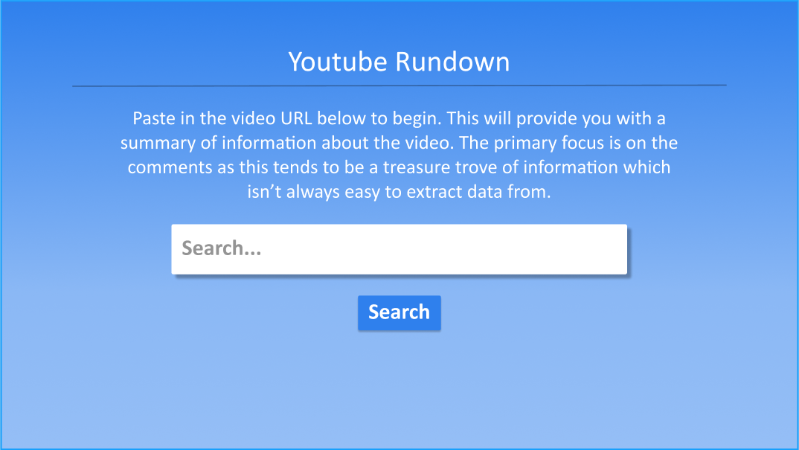
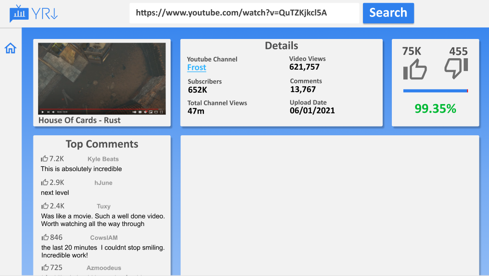

# Youtube Rundown UI

This is the frontend for the Youtube Rundown project. It consumes the [Youtube Rundown GraphQL API](https://github.com/Don-Ghead/yt-cmts-analyser-gql).

I originally started this project to give myself more full stack experience, creating a project from scratch. 
The first phase includes 
- GraphQL API
  - Fetch data from the Google API for Youtube
  - Data transformation & basic sentiment analysis using a JS library
    
- Creating a React front-end to consume this API 
  - No Login/Accounts 
  - Uses Material UI Component Library
  - Two screens (Home and Dashboard)
  - Figma Mockups (WIP)

### Home    

### Dashboard

Phase 2 is mostly going to be looking at creating a Machine Learning implementation of the sentiment analysis component. 
Given the size of Natural Language Processing I don't intend for it to be particularly accurate, it's more so about the experience.

## Available Scripts

In the project directory, you can run:

### `yarn start`

Runs the app in development mode.\
Open [http://localhost:3000](http://localhost:3000) to view it in the browser.

The page will reload if you make edits.\
You will also see any lint errors in the console.

### `yarn test`

Launches the test runner in the interactive watch mode.\
See the section about [running tests](https://facebook.github.io/create-react-app/docs/running-tests) for more information.

### `yarn build`

Builds the app for production to the `build` folder.\
It correctly bundles React in production mode and optimizes the build for the best performance.

The build is minified and the filenames include the hashes.\
Your app is ready to be deployed!

See the section about [deployment](https://facebook.github.io/create-react-app/docs/deployment) for more information.

## Learn More

You can learn more in the [Create React App documentation](https://facebook.github.io/create-react-app/docs/getting-started).

To learn React, check out the [React documentation](https://reactjs.org/).

### Code Splitting

This section has moved here: [https://facebook.github.io/create-react-app/docs/code-splitting](https://facebook.github.io/create-react-app/docs/code-splitting)

### Analyzing the Bundle Size

This section has moved here: [https://facebook.github.io/create-react-app/docs/analyzing-the-bundle-size](https://facebook.github.io/create-react-app/docs/analyzing-the-bundle-size)

### Making a Progressive Web App

This section has moved here: [https://facebook.github.io/create-react-app/docs/making-a-progressive-web-app](https://facebook.github.io/create-react-app/docs/making-a-progressive-web-app)

### Advanced Configuration

This section has moved here: [https://facebook.github.io/create-react-app/docs/advanced-configuration](https://facebook.github.io/create-react-app/docs/advanced-configuration)

### Deployment

This section has moved here: [https://facebook.github.io/create-react-app/docs/deployment](https://facebook.github.io/create-react-app/docs/deployment)

### `yarn build` fails to minify

This section has moved here: [https://facebook.github.io/create-react-app/docs/troubleshooting#npm-run-build-fails-to-minify](https://facebook.github.io/create-react-app/docs/troubleshooting#npm-run-build-fails-to-minify)
